title: Github 101
output: index.html
controls: false
style: style.css

--

# Github 101
## Una introducción al uso de Github

--

### Git es un lenguaje de control de versiones

Permite *recordar cambios a un archivo o conjunto de archivos* para:

* **Revertir** un archivo o proyecto a un estado anterior
* **Comparar** cambios
* **Trackear actividad** de los colaborardores

--

### Github es un hosting de repositorios manejados con Git
<p align="center">Git + web + comunidad + gestión de proyectos</p>

<p align="center">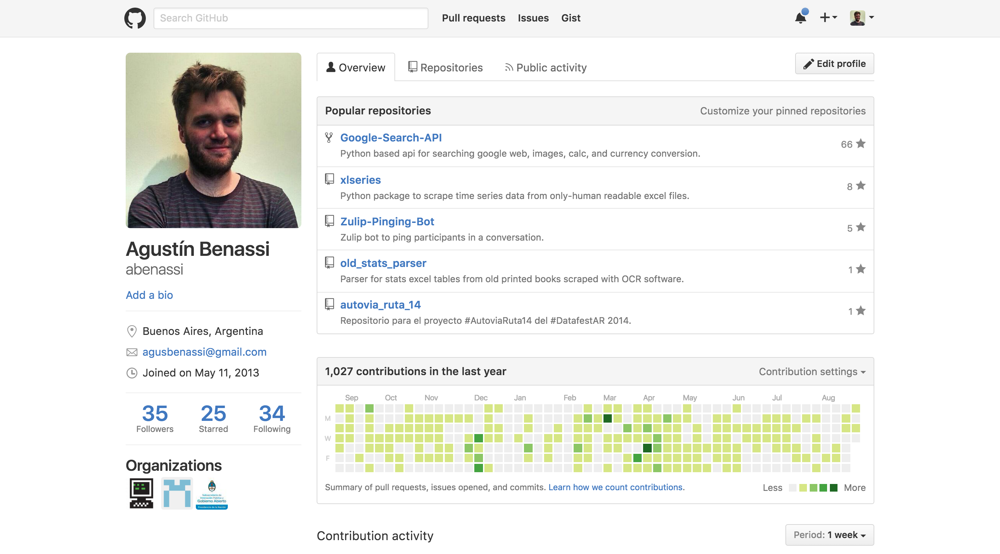
</p>

-- separator

# Git + web

--

### Github: Repositorio local vs. repositorio en la web
<p align="center">**Git + web** + comunidad + gestión de proyectos</p>


<p align="center">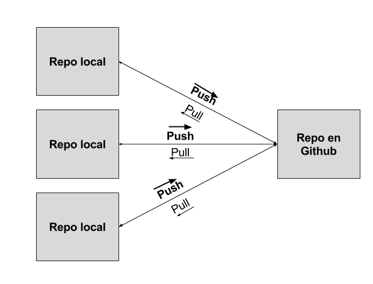</p>

--

### Github: Primeros conceptos
<p align="center">**Git + web** + comunidad + gestión de proyectos</p>

* **Commit**: *Foto del estado* de un archivo o proyecto, con los cambios realizados hasta el momento, a la que puedo volver.
* **Push**: *Subida* de todos los *commits* realizados localmente, a la web.
* **Pull**: *Descarga* de todos los *commits* subidos hasta el momento en la web, a mi versión local.

--

### Github: 1. Crear un repositorio
<p align="center">**Git + web** + comunidad + gestión de proyectos</p>

<p align="center">
</p>
--

### Github: 1. Crear un repositorio (Naming conventions)
<p align="center">Git + web + **comunidad** + gestión de proyectos</p>

**Sitios web**
```
http://domain.com ➔ domain.com.git
http://sub.domain.com ➔ sub.domain.com.git
For other projects, let's keep the lowercase and dashes pattern:
```

**Otros proyectos**
```
star-wars.git
the-empire-strikes-back.git
return-of-the-jedi.git
```

Ver [BC-Policy-Framework-For-GitHub/Naming-Repos](https://github.com/bcgov/BC-Policy-Framework-For-GitHub/blob/master/BC-Gov-Org-HowTo/Naming-Repos.md)

--

### Github: 1. Crear un repositorio (Clonarlo a mi entorno local)
<p align="center">**Git + web** + comunidad + gestión de proyectos</p>

<p align="center">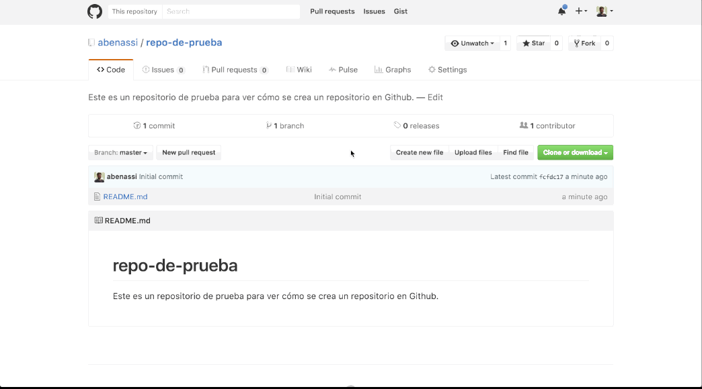
</p>

--

### SourceTree: Command Line vs. Graphical Interface
<p align="center">**Git + web** + comunidad + gestión de proyectos</p>

<p align="center">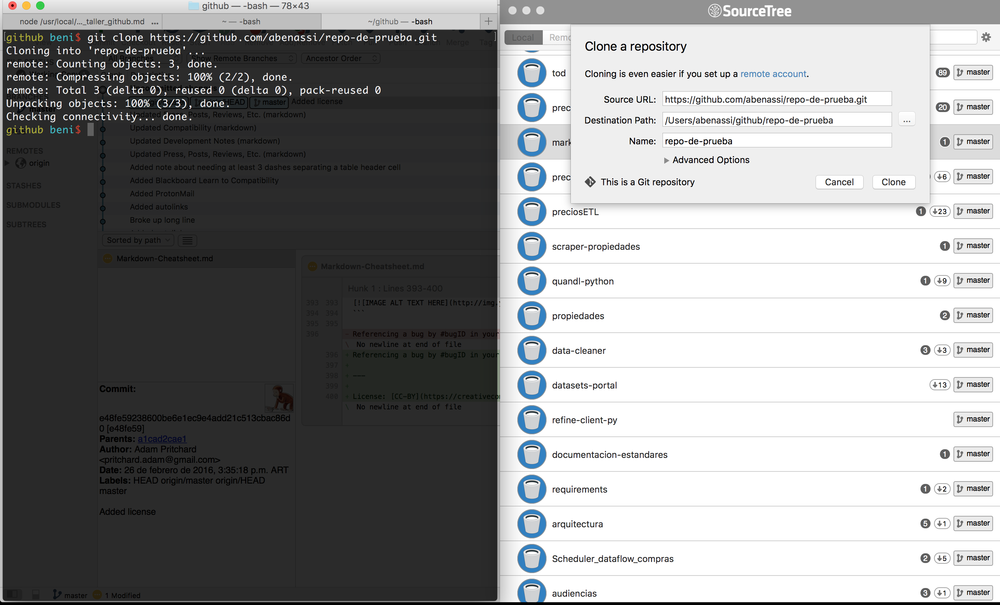</p>

--

### Github: 1. Crear un repositorio (Clonarlo a mi entorno local con SourceTree)
<p align="center">**Git + web** + comunidad + gestión de proyectos</p>

<p align="center">
</p>

--

### Github: 1. Crear un repositorio (Buenas prácticas)
<p align="center">Git + web + comunidad + **gestión de proyectos**</p>

* Un **grupo conceptual** por repositorio
    - Discutir estructura de repositorios **al comienzo**
* Repositorios separados para archivos que sean **compartidos entre múltiples proyectos**
* Repositorios separados para **archivos grandes**

Ver [GitBestPractices](https://sethrobertson.github.io/GitBestPractices/#divide)

-- separator

# Markdown
## Todo repositorio tiene un README.md

--

### Markdown: El lenguaje de marcado de Github
#### Headers

```no-highlight
# H1
## H2
### H3
#### H4
##### H5
###### H6
```

#### H4
##### H5
###### H6

--

### Markdown: El lenguaje de marcado de Github
#### Emphasis

```no-highlight
Emphasis, aka italics, with *asterisks*

Strong emphasis, aka bold, with **double asterisks**

Strikethrough uses two tildes. ~~Scratch this.~~
```

Emphasis, aka italics, with *asterisks*

Strong emphasis, aka bold, with **double asterisks**

Strikethrough uses two tildes. ~~Scratch this.~~

--

### Markdown: El lenguaje de marcado de Github
#### Ordered Lists

```no-highlight
1. First ordered list item
2. Another item
    1. Ordered sub-list
    2. Ordered sub-list
3. Actual numbers don't matter, just that it's a number
```

1. First ordered list item
2. Another item
    1. Ordered sub-list
    2. Ordered sub-list
3. Actual numbers don't matter, just that it's a number

--

### Markdown: El lenguaje de marcado de Github
#### Unordered Lists

```no-highlight
* Unordered sub-list with asterisks.
    - Unordered sub-list with minuses.
        + Unordered sub-list with pluses.
* Unordered sub-list with asterisks.
* Unordered sub-list with asterisks.
```

* Unordered sub-list with asterisks.
    - Unordered sub-list with minuses.
        + Unordered sub-list with pluses.
* Unordered sub-list with asterisks.
* Unordered sub-list with asterisks.

--

### Markdown: El lenguaje de marcado de Github
#### Links and images

```no-highlight
[I'm a link](https://www.google.com)


```

[I'm a link](https://www.google.com)

<p align="center">
</p>

--

### Markdown: El lenguaje de marcado de Github
#### Hay mucho más...

Ver [Markdown Cheatsheet](https://github.com/adam-p/markdown-here/wiki/Markdown-Cheatsheet)

**Secreto**: Esta misma presentación *está hecha en Markdown*!

Ver [Cleaver](https://github.com/jdan/cleaver) 30-sec slideshows for Hackers.S

--

### Github: 2. Commit
<p align="center">**Git** + web + comunidad + gestión de proyectos</p>

<p align="center">
</p>
--

### Github: 2. Commit (Buenas prácticas)
<p align="center">**Git** + web + **comunidad** + gestión de proyectos</p>

* Hacer un commit para cada **cambio lógico**
    - **No meter varios** en un sólo commit
    - **No separar un mismo cambio lógico** en varios commits
* *Commit early and often*: **pequeños commits** son más fáciles de entender y revertir

--

### Github: 2. Commit (Buenas prácticas - mensaje)
<p align="center">**Git** + web + **comunidad** + gestión de proyectos</p>

**Summary line**: descriptiva, compacta, < 50 chars, capitalizada y escrita en presente imperativo.

```
Agrega lista de buenas prácticas a los temas de presentación
```

--

### Github: 2. Commit (Buenas prácticas - mensaje)
<p align="center">**Git** + web + **comunidad** + gestión de proyectos</p>

**Descripción**: **por qué** y **cómo** los cambios fueron realizados y los **side-effects** que pueden tener. Párrafos separados por línea en blanco.

```
Agrega lista de buenas prácticas a los temas de presentación

Se agregan en forma de lista con bullets. A la presentación le faltaba
una guía breve que introduzca algunas buenas prácticas.

Fuentes: https://github.com/agis-/git-style-guide
```

Ver [Git Style Guide](https://github.com/agis-/git-style-guide)

--

### Github: 2. Push
<p align="center">**Git + web** + comunidad + gestión de proyectos</p>

<p align="center">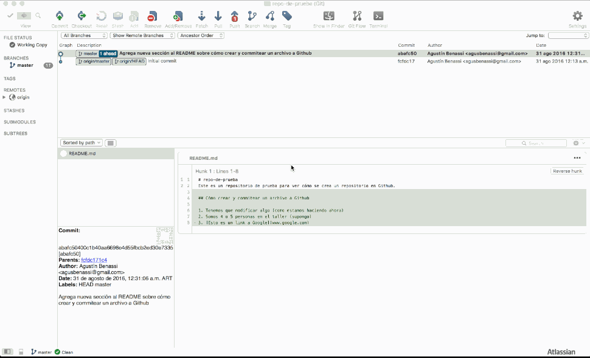
</p>

--

### Github: 2. Push
<p align="center">**Git + web** + comunidad + gestión de proyectos</p>

<p align="center">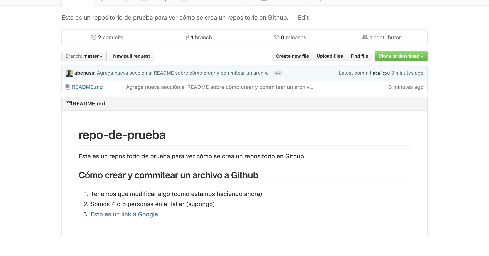</p>

--

### Github: 3. Pull
<p align="center">**Git + web** + comunidad + gestión de proyectos</p>

<p align="center">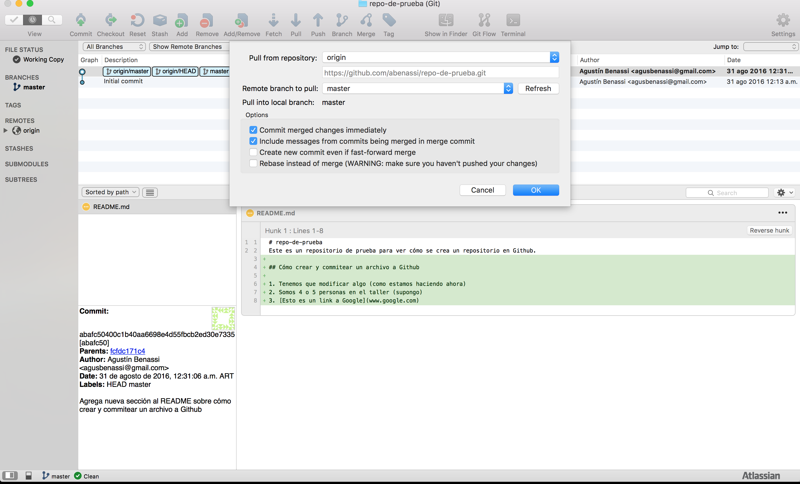
</p>

--

### Recapitulemos

#### Git + web

* **Crear** un repositorio y **clonarlo**

* Escribir un documento en **Markdown**

* *Commitear*, *pushear* y *pullear*


* Mmmm, y si hacemos un ejemplo *ao vivo*?

-- separator

# comunidad + gestión de proyectos

--

### Github: 4. Issues
<p align="center">Git + web + **comunidad + gestión de proyectos**</p>

<p align="center">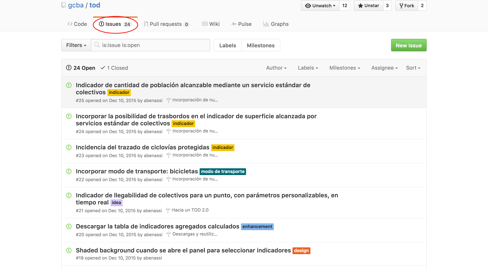
</p>
--

### Github: 4. Issues (Para qué sirven?)
<p align="center">Git + web + **comunidad + gestión de proyectos**</p>

*Issues are where you structure your ideas, with others or alone*

* **Organizar** tareas
* **Discutir** sobre las tareas
* Reportar un **bug**
* Organizar el trabajo con **actores remotos**

--

### Github: 4. Issues (Buenas prácticas - básicas)
<p align="center">Git + web + **comunidad + gestión de proyectos**</p>

* El título de un issue debería **contener al menos un verbo** (deben sugerir una acción)
* **No cerrar prematuramente** un issue. Está ok que un issue permanezca años abierto, siempre que estén bien organizados y sean actuales.
* Mantener **discusiones lógicamente distintas separadas** (abrir otro issue!)
* **Referenciar el issue** en los commits `#29`

Ver [Rules for communicating at GitHub](http://ben.balter.com/2014/11/06/rules-of-communicating-at-github/)

--

### Github: 4. Issues (Buenas prácticas - cómo escribir uno)
<p align="center">Git + web + **comunidad + gestión de proyectos**</p>

* **Contexto**: Explicar las *condiciones* que llevaron a escribir este issue.

* **Problema o idea**: El contexto debería llevar a un *problema o a una idea*.

--

### Github: 4. Issues (Buenas prácticas - cómo escribir uno)
<p align="center">Git + web + **comunidad + gestión de proyectos**</p>

* **Solución o próximo paso**: *Move forward and engage with others*. Se puede solicitar *feedback*, *asignar el issue* a alguien más o dejarlo ahí para *futura investigación*. Pero **siempre** debe proponerse un *próximo paso* para solucionar el issue.

Ver [How we Write Github Issues](https://wiredcraft.com/blog/how-we-write-our-github-issues/)

--

### Github: 4. Issues (Buenas prácticas - etiquetas)
<p align="center">Git + web + **comunidad + gestión de proyectos**</p>

* Organizar issues con **etiquetas**
* Tipos de etiquetas:
    - **Gihtub labels**: Todos los conocen y usan.
    - **Acción necesaria**: Clasifica por tipo de acción que requieren.
    - **Status/progreso**: ¿Cómo viene el trabajo?
    - **Componentes**: ¿A qué componentes del sistema afecta?

--

### Github: 4. Issues (Buenas prácticas - etiquetas)
<p align="center">Git + web + **comunidad + gestión de proyectos**</p>

* Nombrar etiquetas sólo con **minúsculas**

Ver [How we organize GitHub issues: A simple styleguide for tagging](https://robinpowered.com/blog/best-practice-system-for-organizing-and-tagging-github-issues/)

Ver [Github Labels and Milestones](https://docs.saltstack.com/en/latest/topics/development/labels.html)

--

### Github: 4. Issues (Integración)
<p align="center">Git + web + comunidad + **gestión de proyectos**</p>

<p align="center">[Waffle](https://waffle.io/)</p>

<p align="center">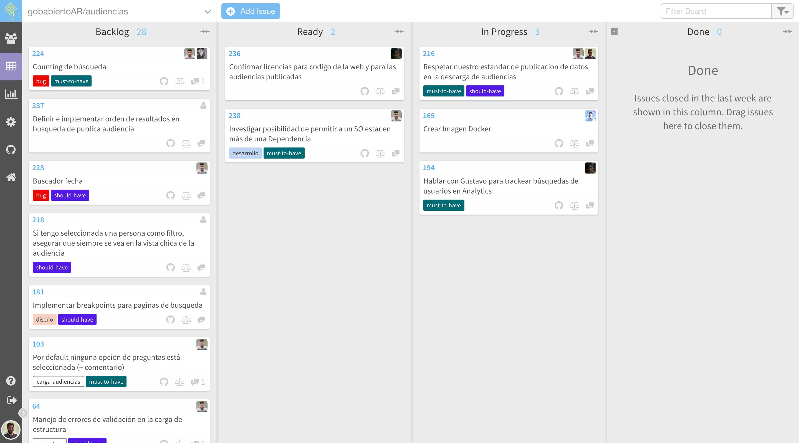
</p>

--

### Github: 4. Issues (Milestones)
<p align="center">Git + web + **comunidad + gestión de proyectos**</p>

<p align="center">Agrupación de issues en **hitos** o **sprints**</p>

<p align="center">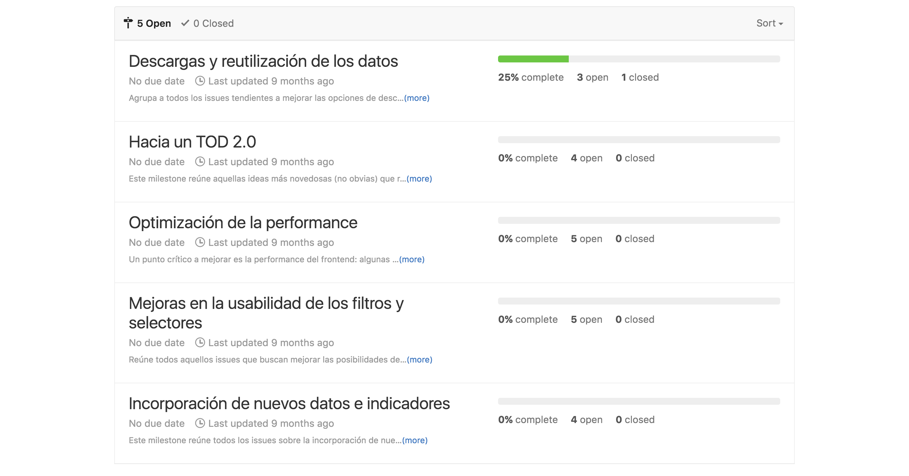
</p>

--

### Github: 5. READMEs
<p align="center">Git + web + **comunidad + gestión de proyectos**</p>

* **Nombre del proyecto**
* **Descripción**: Importancia del proyecto, lo que hace.
* **Indice**: Si es largo o detallado, incluir una *TOC*.
* **Instalación**: ¿Cómo instalo el proyecto? Incluir *GIF*.
* **Uso**: ¿Cómo uso esto? Ej. de código, screenshots, link a otros docs.
* **Contribuciones**: Cómo contribuir al proyecto
* **Créditos**: Autores, colaboradores, inspiraciones..
* **Licencia**

--

### Github: 5. READMEs (Referencias)
<p align="center">Git + web + **comunidad + gestión de proyectos**</p>

Ver [Formatting your README](https://guides.github.com/features/wikis/)

Ver [Guidelines for repository contributors](https://help.github.com/articles/setting-guidelines-for-repository-contributors/)

--

### Github: 5. Wiki
<p align="center">Git + web + **comunidad + gestión de proyectos**</p>

<p align="center">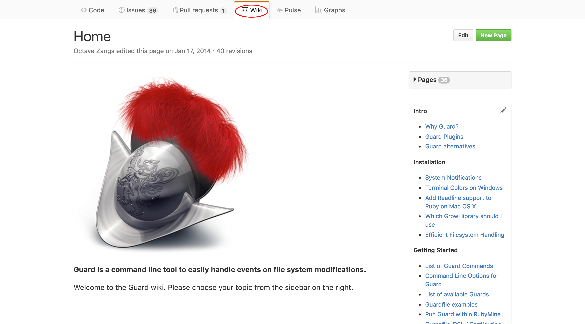
</p>

--

### Github: 5. Wiki
<p align="center">Git + web + **comunidad + gestión de proyectos**</p>

<p align="center">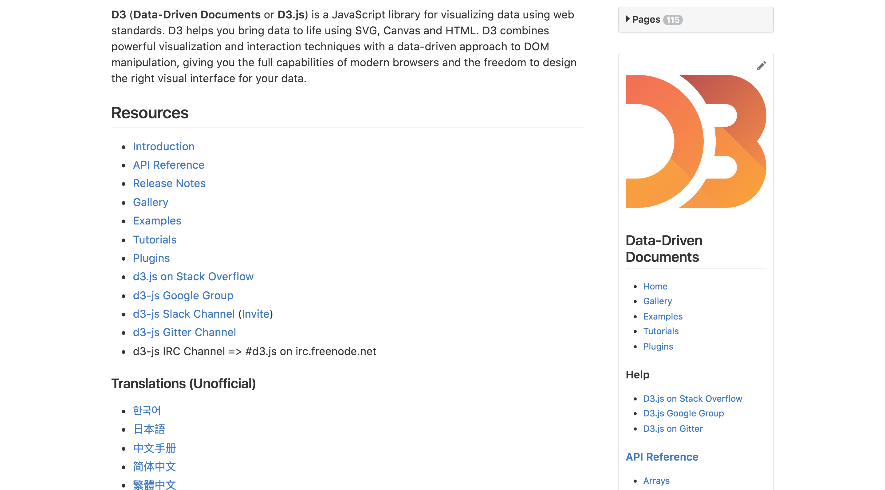
</p>

--

### Github: 5. Wiki
<p align="center">Git + web + **comunidad + gestión de proyectos**</p>

<p align="center">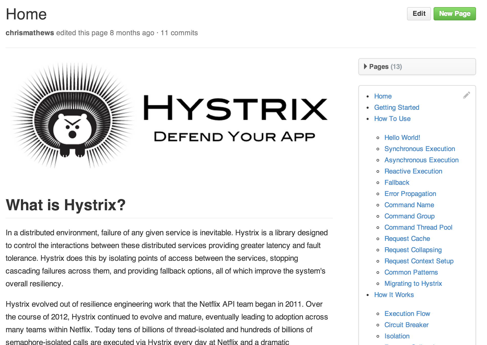
</p>

--

### Github: 5. Wiki
<p align="center">Git + web + **comunidad + gestión de proyectos**</p>

*Just as writing good code and great tests are important, **excellent documentation helps others** use and extend your project.*

* Se pueden **clonar** y editar localmente, como un repo

Ver [Creating your wiki](https://guides.github.com/features/wikis/)

Ver [About GitHub Wikis](https://help.github.com/articles/about-github-wikis/)

Ver [Projects with great wikis](https://github.com/showcases/projects-with-great-wikis)

--

### Otros temas

* Otros conceptos importantes en Github
    - Forks
    - [Pull Request](https://www.thinkful.com/learn/github-pull-request-tutorial/)
    - Merge
    - Branches
    - Conflictos de edición
* *CONTRIBUTING.md*
* *Commit tags* y *HISTORY.md*
* Licencias
* Read The Docs
* Github Pages

--
# :-)
## **¡Gracias!**


